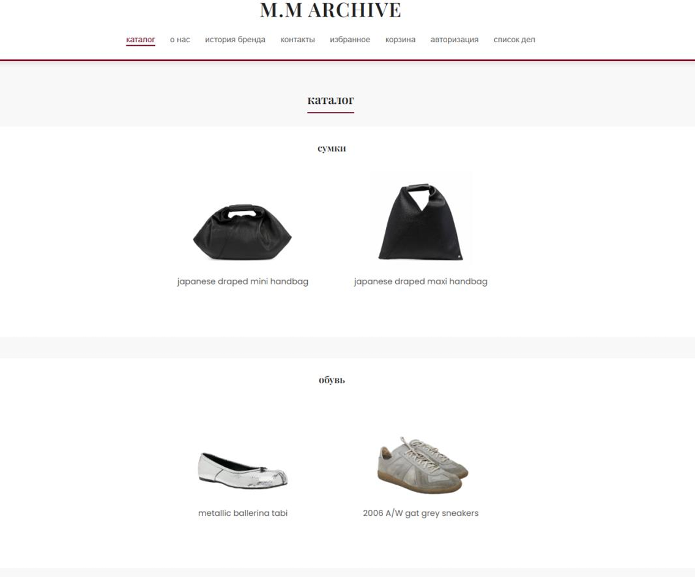

# full-stack web application

a full-stack e-commerce web application inspired by the maison margiela brand

## about

a web-based clothing store with a modern frontend and backend api. the application provides a complete user experience for browsing and managing products, as well as additional user functionality

users can:

  browse the product catalog  
  view products by category  
  view detailed product information  
  add products to favorites  
  remove products from favorites  
  add products to the shopping cart  
  remove products from the shopping cart  
  view products in the shopping cart  
  create personal tasks  
  edit tasks  
  delete tasks  
  change task status  
  view their personal task list  

## tech stack

### frontend

  javascript  
  html  
  css  

### backend

  typescript  
  nestjs  
  node.js  
  express  
  rest api  
  graphql  

### database

  postgresql  
  prisma orm  

### infrastructure

  render  
  yandex object storage  
  git  
  github  

## architecture

  products — product catalog and product management  
  cart — shopping cart management  
  favorites — favorite products management  
  todos — personal task management  

each module contains services, controllers, dto classes and graphql components

## main page

